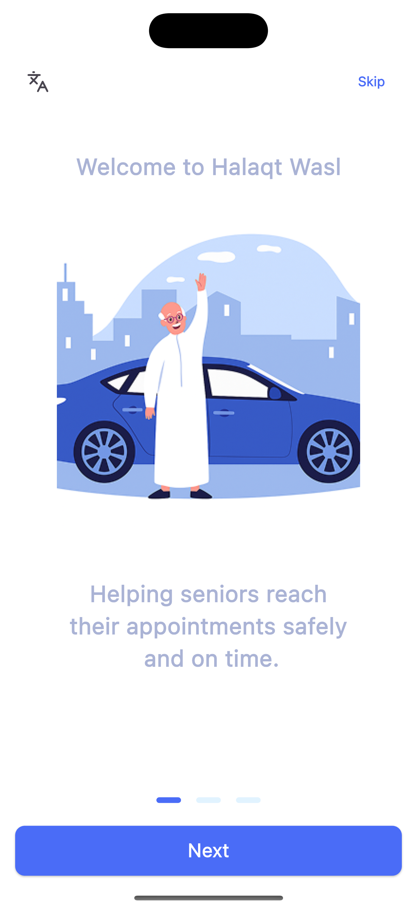
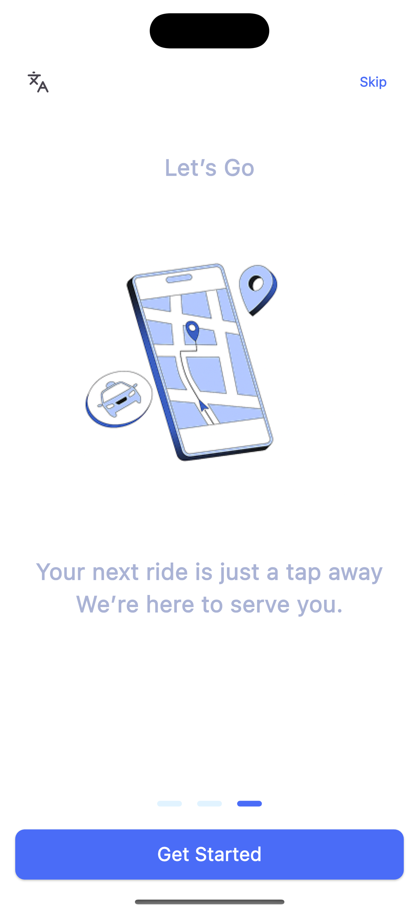
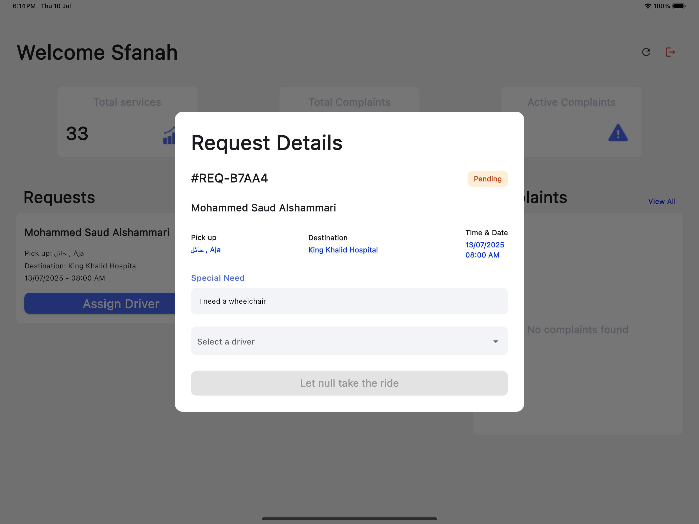

## Halaqat Wasl

Halaqat Wasl is a mobile application developed using Dart & Flutter. It is designed to streamline and manage transportation services provided by charitable organizations.

The system is composed of three interconnected applications:

1. Charity App – For charity organizations to manage requests, drivers, and statistics.
2. Driver App – For drivers to receive assignments and track tasks.
3. Client App – For clients to request transportation easily.
---

## Problem Solving Approach

The app solves several issues faced in managing charity-based transportation services:

### Manager App

Allows the charity organization to:

- View statistics such as total services, complaints and active complaints.
- Approve new drivers to operate under the organization's name.
- Assign specific drivers to new incoming service requests.
- Respond quickly and efficiently to client complaints.

### Driver App

Designed for drivers to:

- View assigned service requests coming from the charity organization.
- Access detailed trip information, including:
  - Client’s pickup address (displayed via Google Maps)
  - Destination address (also shown through Google Maps)
  - Client’s contact number

### Main App

A simple and accessible interface that allows clients to:

- Request transportation services with ease.
- View previous transportation requests.
- Submit complaints regarding specific services if needed.

---

## Key Features and Functionalities

### Authentication (All Apps)
- Secure Authentication functionality for all user types (charity staff, drivers, clients).

---

### Main App Features

- **Onboarding:** A smooth, guided onboarding experience for new clients to introduce app features.
- **Submit Transportation Requests:** Clients can easily request transportation through a simple, user-friendly form.
- **View Previous Requests:** Clients have access to a history of their past transportation requests for tracking and reference.
- **Edit Profile:** Clients can update their personal and contact information anytime.
- **Submit Complaints:** Clients can file complaints related to their transportation services directly through the app.

---

### Charity App Features

- **Service Management:** Charity staff can:
  - View service statistics and reports.
  - Accept new transportation requests.
  - Assign requests to specific drivers.
  - Approve new drivers to operate under the charity.
  - Enable or disable driver accounts as needed.
- **Complaint Handling:** Charity managers can review, manage, and respond to complaints submitted by clients to ensure quality service and satisfaction.

---

### Driver App Features

- **Request Management:** Drivers can view transportation requests assigned to them, including:
  - Pickup and destination locations (with map integration).
  - Client contact information.
- **Review Past Requests:** Drivers can track and review completed service requests.

---

## App Flow

  
  
  
  

  
  
  
  

  
  
  

---

## Project Properties

- **Project Name:** *Halaqat Wasl*
- **Platform:** Mobile (Android & iOS)
- **Programming Language:** Dart
- **Framework:** Flutter
- **Backend & Authentication Service:** Supabase
- **State Management:** BLoC
- **Google Services:** Google Map

## 👤 Project Members

- **[Mohammed S. Alshammari](https://www.linkedin.com/in/mohammedsalshammari/)**
- **[Ameerah Aloufi](https://www.linkedin.com/in/ameerah-aloufi-95b58726a/)**
- **[Abdulrahman Alsalem](https://www.linkedin.com/in/abdulrahman-alsalem-bbb5a3274/)**
- **BushraAlzoman**

